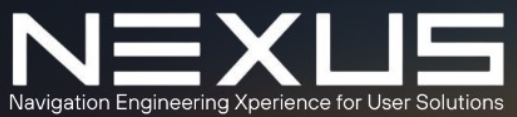
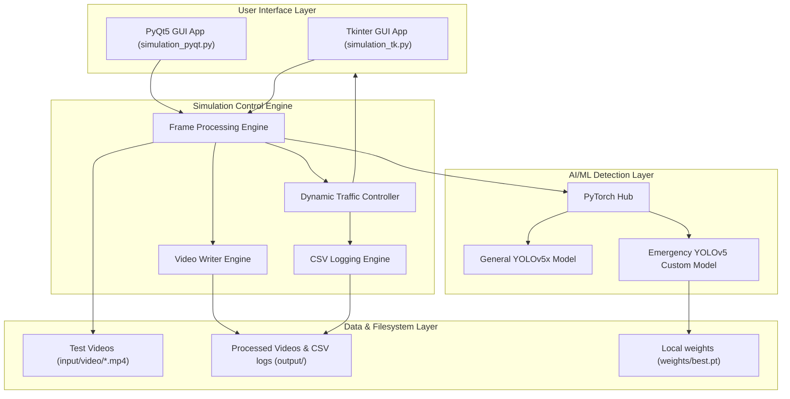
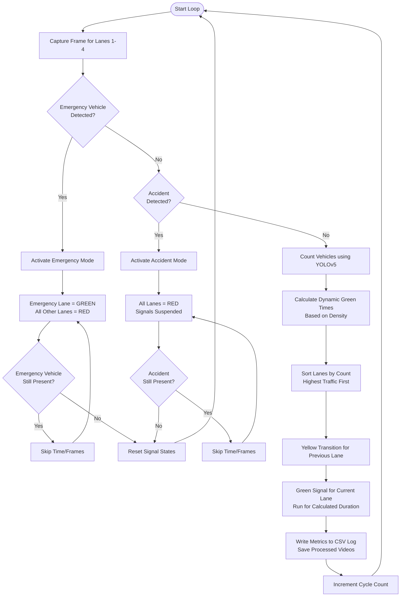

<div align="center">
  
  <h1>AI-Powered Intelligent Traffic Management System</h1>
  <p><strong>A dynamic, real-time traffic signal optimization and emergency prioritization system using YOLOv5.</strong></p>

  [](https://www.python.org/)
  [](https://github.com/ultralytics/yolov5)
  [](LICENSE)
  []()
</div>

---

## 📌 Project Overview

Traditional traffic lights operate on fixed timers, leading to unnecessary delays, increased congestion, and higher vehicle emissions. The **AI-Powered Intelligent Traffic Management System** is a computer vision-driven solution designed to dynamically optimize traffic signal timings. 

By analyzing real-time camera feeds across four lanes, the system calculates vehicle density, dynamically schedules green-light intervals, and prioritizes emergency vehicles (ambulances, fire trucks) to ensure rapid response times and smoother transit.

---

## ✨ Features

- 🚗 **Real-Time Vehicle Detection:** Utilizes a standard YOLOv5x model to detect and count passenger cars, trucks, buses, and motorcycles across four distinct lanes.
- 🚨 **Emergency Vehicle Prioritization:** Uses a custom-trained, fine-tuned YOLOv5 model to detect emergency vehicles (e.g., ambulances, fire trucks), instantly switching traffic signals to clear the lane.
- ⚠️ **Accident Detection & Response:** Automatically recognizes accidents, triggering immediate red signals to suspend normal traffic flow and protect road safety.
- ⚡ **Dynamic Time Allocation:** Calculates optimal green light duration for each lane based on relative traffic percentage.
- 🖥️ **Dual GUI Visualizations:** Offers both a lightweight **Tkinter-based** simulation dashboard and a premium, graphical **PyQt5-based** desktop dashboard displaying lane statuses, counts, and active turns.
- 📊 **CSV Analytics & Video Logs:** Saves runtime metrics to `output/traffic_log.csv` and compiles annotated, processed video streams for post-incident audits.

---

## 🛠️ Tech Stack

- **Core Logic & Simulation:** Python 3.8+
- **Deep Learning Framework:** PyTorch & PyTorch Hub
- **Computer Vision:** OpenCV (Python), Pillow, NumPy
- **Object Detection Model:** YOLOv5 (Ultralytics)
- **GUI Frameworks:** PyQt5 (High-fidelity mockup), Tkinter (Lightweight backend dashboard)
- **Data Analytics:** Pandas, SciKit-Learn, Matplotlib

---

## 🧠 Model Integration & Lifecycle (Where is YOLOv5?)

This project relies on the YOLOv5 architecture in three distinct ways. It is important to understand where the code, weights, and caches reside:

### 1. The Local `yolov5/` Directory
The `yolov5/` folder in the root of the repository is a clone of the official Ultralytics YOLOv5 codebase. 
- **Purpose:** This local folder contains training scripts (`yolov5/train.py`), detection scripts (`yolov5/detect.py`), model configurations (`yolov5/models/`), and utility modules.
- **Role:** It is primarily used for offline reference, retraining custom weights, and optional offline execution.

### 2. Model Weights (`.pt` files)
- **Custom Emergency Weights (`weights/best.pt`):** This is the custom-trained model file included directly inside the repository. It is fine-tuned to classify emergency vehicles (e.g., ambulances, fire trucks).
- **Standard Weights (`yolov5x.pt`):** The standard coco model weights are *not* committed directly to the Git repository to keep the repository lightweight. Instead, the runtime script calls PyTorch Hub to download them on demand.

### 3. Caching & PyTorch Hub Execution
By default, the simulation uses PyTorch Hub to load models:
- **General Vehicle Detection:** Loaded using `torch.hub.load('ultralytics/yolov5', 'yolov5x', pretrained=True)`.
- **Emergency Vehicle Detection:** Loaded using `torch.hub.load('ultralytics/yolov5', 'custom', path='weights/best.pt')`.

During execution, PyTorch Hub downloads the YOLOv5 framework and model weights from the official GitHub release to your local machine's cache directory:
- **Windows:** `C:\Users\<YourUsername>\.cache\torch\hub\`
- **Linux/macOS:** `~/.cache/torch/hub/`
Once downloaded, the model runs locally using the cached assets; no active internet connection is required for subsequent runs.

### 🔌 Running Completely Offline (Optional)
If you want to run the project on a machine with no internet access (preventing PyTorch Hub from accessing GitHub), you can configure the scripts to load YOLOv5 from the local `yolov5/` directory instead of the remote repository. 

Modify the loader lines in [simulation_tk.py](file:///c:/Projects/team-nexus/src/simulation_tk.py) and [simulation_pyqt.py](file:///c:/Projects/team-nexus/src/simulation_pyqt.py) as follows:

```python
# Change remote load:
# model = torch.hub.load('ultralytics/yolov5', 'yolov5x', pretrained=True)
# custom_model = torch.hub.load('ultralytics/yolov5', 'custom', path='weights/best.pt', force_reload=True)

# To local load:
model = torch.hub.load('yolov5', 'yolov5x', source='local', pretrained=True)
custom_model = torch.hub.load('yolov5', 'custom', path='weights/best.pt', source='local')
```
*(Ensure `yolov5s.pt` or `yolov5x.pt` weights are placed inside the `weights/` directory on your machine before running).*

---

## 🏗️ Architecture & Component Design

The application is structured around a modular pipeline separating visual object detection, signal control, telemetry logging, and user interfaces.



### Request Flow and Decision Tree

The traffic controller evaluates video feeds frame-by-frame and adjusts signals using the following decision logic:



---

## 📐 Algorithm & Dynamic Timing Formulation

The green light duration for each lane is calculated dynamically based on its relative congestion density. The core formula distributes an additional allocation of `4.1` seconds among all lanes based on their vehicle percentage:

$$\text{Green Light Time}_{i} = \text{Baseline Time} + \left( \frac{\text{Vehicle Count}_{i}}{\sum_{j=1}^{4} \text{Vehicle Count}_{j}} \times \text{Additional Time} \right)$$

Where:
- **Baseline Time** $= 0.1 \text{ seconds}$
- **Additional Time** $= 4.1 \text{ seconds}$
- **Vehicle Count $_{i}$** $=$ Number of vehicles detected in Lane $i$

### Concrete Example Walkthrough
Consider a traffic cycle where the system detects the following vehicle distributions:
- **Lane 1 (North):** 12 vehicles
- **Lane 2 (East):** 5 vehicles
- **Lane 3 (South):** 3 vehicles
- **Lane 4 (West):** 0 vehicles
- **Total Vehicles** $= 12 + 5 + 3 + 0 = 20 \text{ vehicles}$

The dynamic calculations result in:

| Lane | Vehicle Count | Percentage of Total | Green Light Duration |
| :--- | :---: | :---: | :--- |
| **Lane 1** | 12 | $60\%$ | $0.1 + (0.60 \times 4.1) = \mathbf{2.56 \text{ seconds}}$ |
| **Lane 2** | 5 | $25\%$ | $0.1 + (0.25 \times 4.1) = \mathbf{1.125 \text{ seconds}}$ |
| **Lane 3** | 3 | $15\%$ | $0.1 + (0.15 \times 4.1) = \mathbf{0.715 \text{ seconds}}$ |
| **Lane 4** | 0 | $0\%$ | $0.1 + (0.00 \times 4.1) = \mathbf{0.10 \text{ seconds}}$ |

*The lanes are then served in sorted order of density: Lane 1 (2.56s) ➔ Lane 2 (1.125s) ➔ Lane 3 (0.715s) ➔ Lane 4 (0.1s).*

---

## 📂 Project Structure

The repository is organized following clean and modern structural practices:

```bash
team-nexus/
├── archive/                  # Legacy project archives and datasets
│   ├── IndoBelgium.rar
│   ├── Input Videos_Images.rar
│   └── TUNING DATASET.zip
├── assets/                   # Static branding and user interface assets
│   ├── brand/
│   │   └── logo.png          # System branding logo
│   ├── gui/
│   │   └── gui_background.png # Mockup background layout image for PyQt5
│   └── training_results/     # YOLOv5 training metrics and graphs
│       ├── F1_curve.png
│       ├── confusion_matrix.png
│       └── results.png
├── docs/                     # Project documentations
│   └── project_report.pdf    # Comprehensive project report
├── input/                    # Target directories for input feeds
│   ├── image/
│   └── video/                # Test source lane videos (lane1.mp4 to lane4.mp4)
├── output/                   # Ignored runtime output directories
│   ├── image/
│   └── video/                # Processed output streams (*_processed.avi)
├── src/                      # Source Python code
│   ├── simulation_pyqt.py    # PyQt5 high-fidelity traffic simulation
│   └── simulation_tk.py      # Tkinter traffic simulation dashboard
├── weights/                  # AI weights and models
│   ├── best.pt               # Fine-tuned YOLOv5 emergency vehicle weights
│   └── yolov5s.pt            # Cached standard YOLOv5s weights
├── yolov5/                   # YOLOv5 core codebase module
├── requirements.txt          # Python dependency packages
└── README.md                 # Project documentation
```

---

## 🚀 Installation & Setup

### Prerequisites
Make sure you have Python 3.8, 3.9, or 3.10 and `pip` installed on your machine.

1. **Clone the Repository:**
   ```bash
   git clone https://github.com/Akash-Shaw1/team-nexus.git
   cd team-nexus
   ```

2. **Install Core Dependencies:**
   Install required Python packages listed in `requirements.txt`:
   ```bash
   pip install -r requirements.txt
   ```
   *Note: PyTorch installation varies depending on CUDA availability. Refer to [PyTorch's Official Guide](https://pytorch.org/get-started/locally/) to install the GPU-accelerated version if you have a compatible NVIDIA GPU.*

3. **Install PyQt5 (For the PyQt5 interface):**
   ```bash
   pip install PyQt5
   ```

---

## 💻 Usage

To run the simulation, execute either of the source scripts from the **project root directory** to ensure paths resolve correctly.

### Option 1: PyQt5 Simulation Dashboard (Recommended)
This launches a premium, fully designed PyQt5 simulation reflecting live traffic lights, queue durations, emergency status, and active turning arrows overlaid on a mockup background:
```bash
python src/simulation_pyqt.py
```

### Option 2: Tkinter Simulation Dashboard
This launches a lightweight Tkinter window monitoring lane vehicle counts and traffic signal states:
```bash
python src/simulation_tk.py
```

### Simulation Output
- **Telemetry logs:** Stored in `output/traffic_log.csv` containing cycle-by-cycle metrics of vehicle counts, traffic percentages, signal states, and lane priority allocations.
- **Rendered Videos:** Processed video streams overlaying green/red bounding boxes around general/emergency vehicles are saved under `output/video/lane{1-4}_processed.avi`.

---

## 🏋️ Custom Model Training

The custom model weights stored in `weights/best.pt` were trained using the local `yolov5/` framework directory. If you wish to retrain or fine-tune the model on your custom dataset, follow these guidelines:

1. **Prepare Dataset Configuration:**
   Create a `dataset.yaml` file indicating target label directories:
   ```yaml
   train: ../dataset/images/train
   val: ../dataset/images/val

   nc: 2
   names: ['accident', 'emergency_vehicle']
   ```

2. **Run Training Script:**
   Launch the training script from the root of the repository:
   ```bash
   python yolov5/train.py --img 640 --batch 16 --epochs 50 --data dataset.yaml --weights weights/yolov5s.pt --device 0
   ```

3. **Export and Move Weights:**
   Upon training completion, the best weights will be generated in `yolov5/runs/train/exp/weights/best.pt`. Move this file to your `weights/` directory.

---

## 📊 Training Results

The model was custom-tuned to detect emergency vehicles using a specific training pipeline. Performance metrics graphs are saved under `assets/training_results/` for inspection, including:
- **Precision & Recall Curves (`P_curve.png`, `R_curve.png`)**
- **F1 Score Curve (`F1_curve.png`)**
- **Confusion Matrix (`confusion_matrix.png`)**

---

## ❓ FAQ & Troubleshooting

#### Q1: Where are the YOLOv5 standard model files downloaded on my local machine?
They are downloaded to your user cache directory under `.cache/torch/hub/ultralytics_yolov5/`. If the download fails due to internet issues, download `yolov5x.pt` manually and pass it to the PyTorch Hub local loader.

#### Q2: Why is the PyQt5 simulation window blank or failing to open?
Verify that you have PyQt5 installed properly (`pip install PyQt5`) and that your display drivers are up-to-date. If PyQt5 issues persist due to system graphics configurations, run the Tkinter dashboard `python src/simulation_tk.py` which has no heavy graphics dependencies.

#### Q3: How does the system handle multiple emergency vehicles?
If emergency vehicles are detected in multiple lanes simultaneously, the controller prioritizes the lane with the highest relative vehicle density first.

#### Q4: Can I run this with GPU acceleration?
Yes. PyTorch automatically uses your GPU (CUDA) if it is available. If it falls back to CPU, ensure your installed PyTorch matches your local CUDA driver version.

---

## 🔮 Future Improvements

- **CCTV Camera Integration:** Connect directly to RTSP network cameras for real-time live-feed deployment.
- **Advanced State Tracking:** Integrate deep learning object trackers (e.g., ByteTrack/DeepSORT) to prevent counting the same vehicle multiple times.
- **Web Interface:** Port the PyQt5 dashboard to a web app dashboard (using React or Next.js) with remote monitoring capabilities.
- **Lightweight Model Deployment:** Export weights to ONNX/TensorRT formats to decrease latency and inference overhead on edge devices (like Raspberry Pi/NVIDIA Jetson).

---

## 🤝 Contributing

Contributions are welcome! Please fork this repository, create a branch for your updates, and open a Pull Request. For major changes, please open an issue first to discuss what you would like to modify.

---

## 📄 License

This project is licensed under the MIT License. See the [LICENSE](LICENSE) file for more information.
